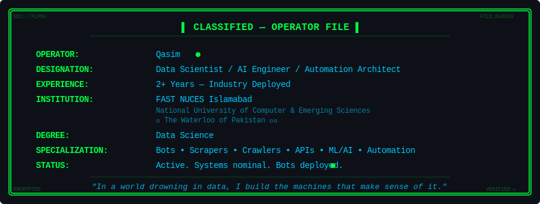
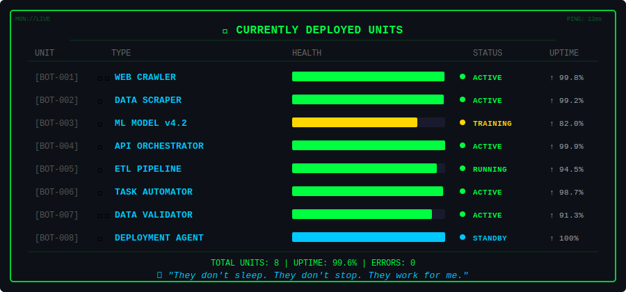
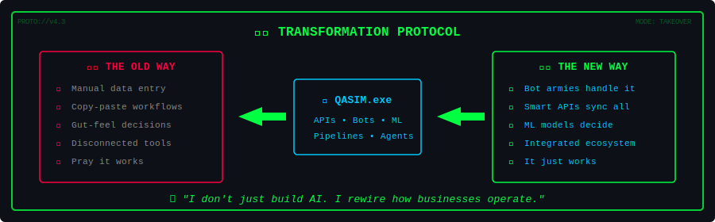
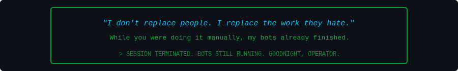

<!-- MATRIX RAIN HEADER -->

 

<!-- TYPEWRITER BOOT SEQUENCE -->

 

 

<!-- CLASSIFIED BADGES -->

<!-- WHOAMI - PYTHON CLASS -->

<!-- OPERATOR PROFILE -->

<!-- CURRENTLY DEPLOYED UNITS -->

<!-- BOT ARMY -->

<!-- SPIDER WEB -->

 

## `> ls /arsenal/weapons_systems/`

**`/core/languages/`**

**`/weapons/ai_ml/`**

**`/weapons/extraction/`**

**`/weapons/api_backend/`**

**`/infrastructure/`**

<!-- TRANSFORMATION -->

 

## `> neofetch --github-stats`

 

 

## `> render --contribution-snake`

<picture>
  <source media="(prefers-color-scheme: dark)" srcset="https://raw.githubusercontent.com/Qasim4369/Qasim4369/output/github-snake-dark.svg" />
  <source media="(prefers-color-scheme: light)" srcset="https://raw.githubusercontent.com/Qasim4369/Qasim4369/output/github-snake.svg" />
  
</picture>

  

<!-- FOOTER -->

  

**`> connection.establish()`**

